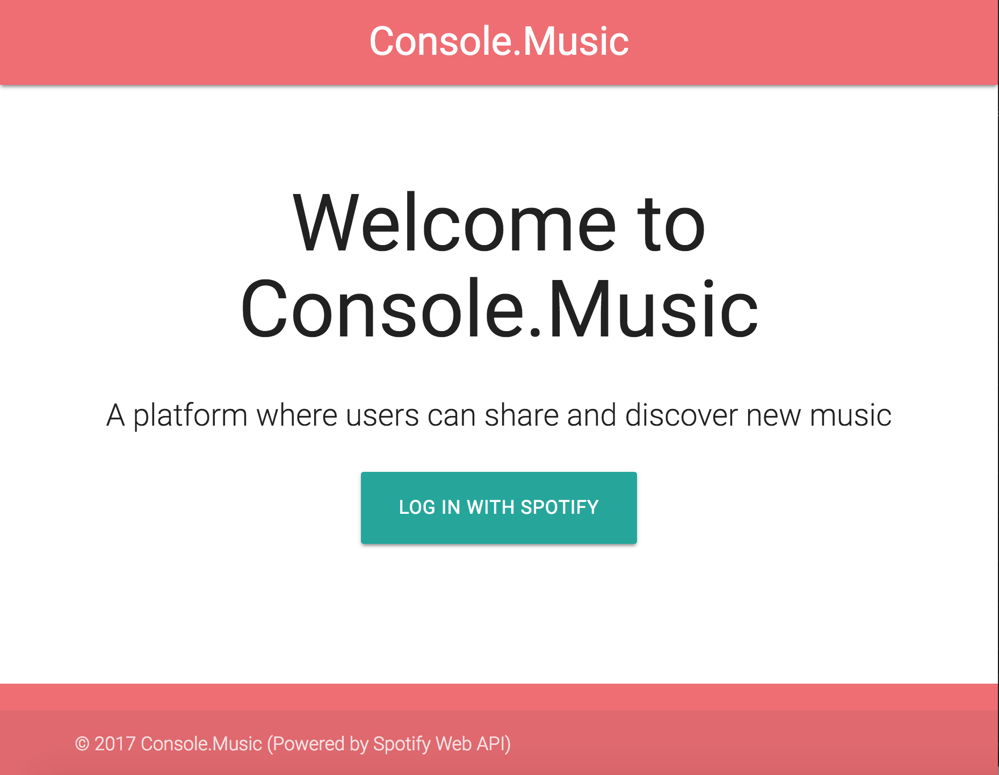
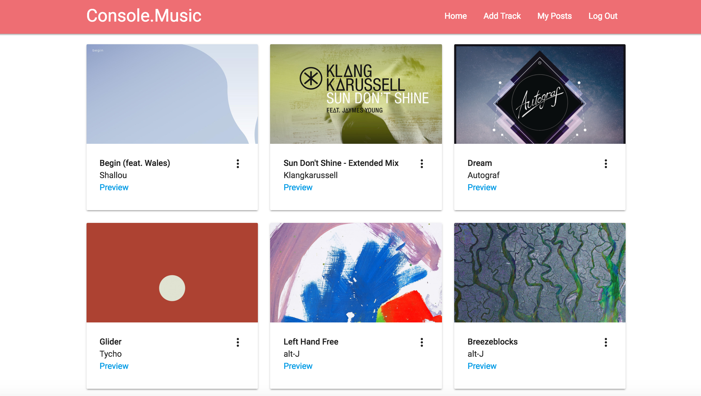
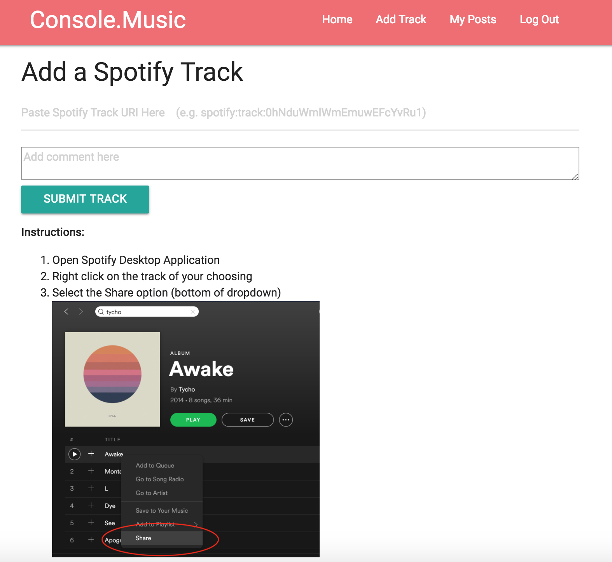
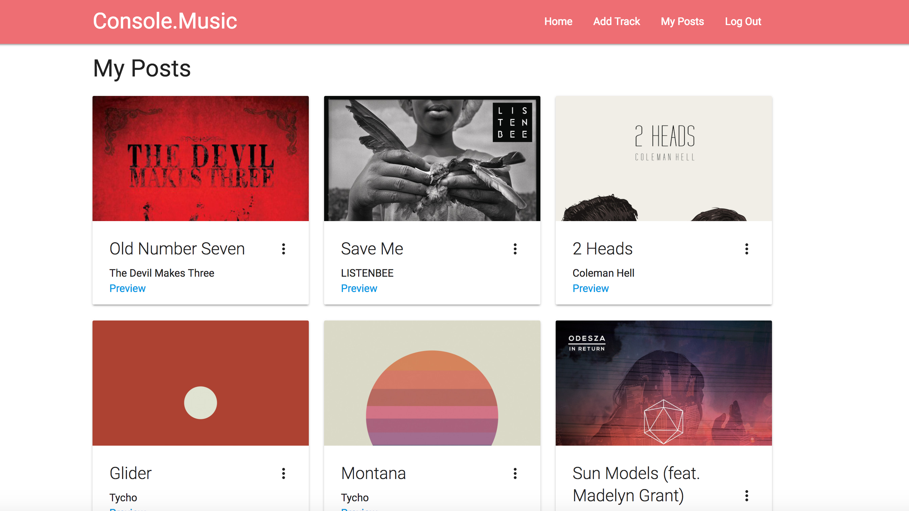

# Console.Music

## Description

Web application for users to share and explore Spotify tracks posted by others. The goal of this project was to build a fully functioning CRUD (create, read, update, delete) application that connects to an API. This was the first full-stack web application I built on my own and was also my first time incorporating social sign-in functionality. The app was built over one week.

## Technologies Used

* [EJS](http://www.embeddedjs.com/) - Client-side templating
* [Node.js](https://nodejs.org/en/) - Server-side scripting
* [Express](https://expressjs.com/) - Web application framework for Node.js
* [PostrgeSQL](https://www.postgresql.org/) - Relational database
* [Materialize](http://materializecss.com/) - Web app styling
* [Heroku](https://www.heroku.com/) - Web app deployment

## Deployed Site

https://ishamd-music-library.herokuapp.com/

## Views

### Landing Page

New users are prompted to sign in using their Spotify credentials. The passport-spotify node library is utilized for authentication.

### Home Page

After signing in, users can scroll through tracks that have been posted by other users or themselves. Each card contains track details including a 30 second preview and link to the full track.

### Add Track Page

Users can upload a track by pasting in the Spotify URI. Users can also leave a comment about the song for other users to see.

### Manage Posts

Users have the ability to see all of their posts and they also have the ability to edit or delete them if needed.

